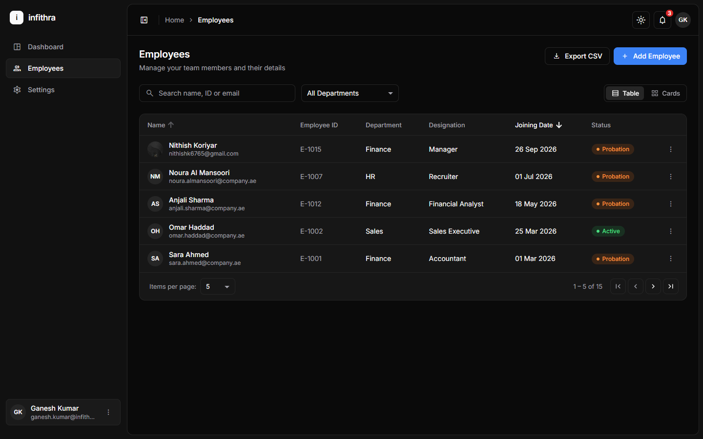
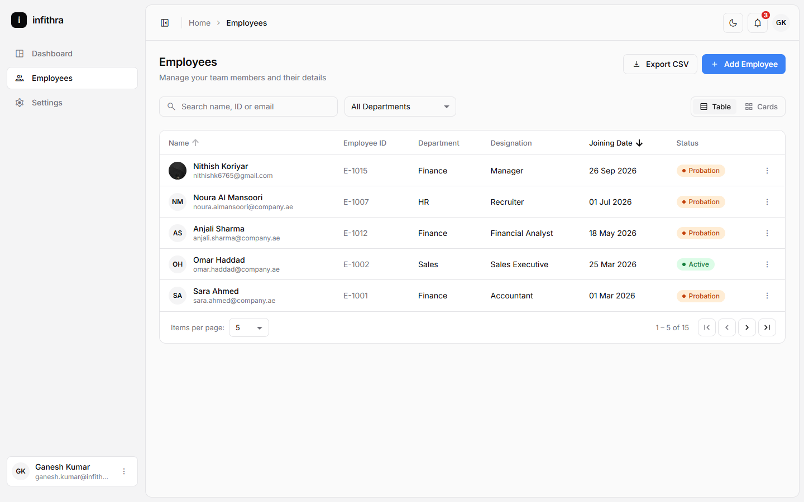
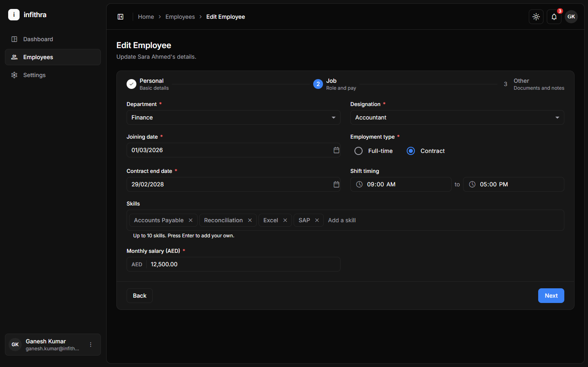
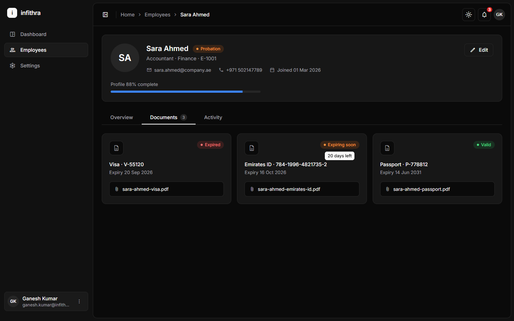
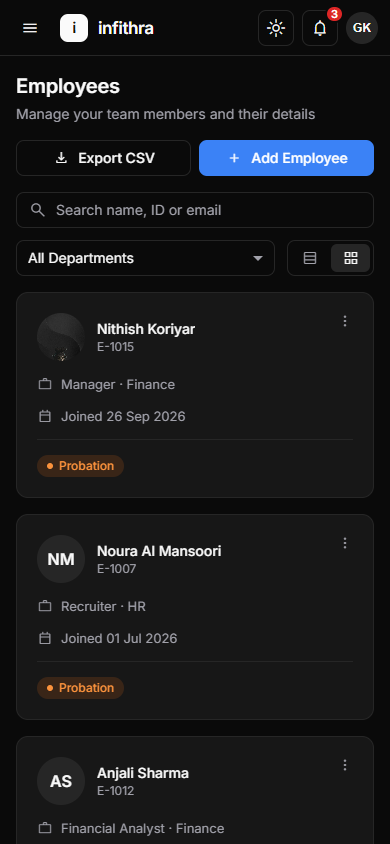

# infithra — Employee Management

An Angular machine test: the Employee Management module of an HR/payroll app for UAE/GCC
companies. It covers an employee list, a 3-step add/edit form and an employee details page,
inside a shared app shell with a sidebar, top bar and breadcrumb. The UI uses Angular Material,
restyled flat and minimal. Dark mode is the default, with a light theme toggle. All data is
loaded through Angular services that make `HttpClient` calls to a mock API.

**Live demo:** https://nithishkoriyar.github.io/infithra_ems/employees

The demo is deployed to GitHub Pages by `.github/workflows/deploy.yml` on every push to
`master`, and it works without any setup. GitHub Pages can't run json-server, so the production
build answers the same API calls in the browser from `mock-api/db.json` (see
[Architecture notes](#architecture-notes)). Adding, editing and deleting all work; changes last
until the browser tab is closed.

## Features

- **Employee list** (`/employees`)
  - Table and card views, remembered per browser.
  - Search by name, ID or email; filter by department; sort by name or joining date.
  - Pagination with 5 / 10 / 20 per page.
  - Loading skeleton, empty and error states with Retry.
  - Delete with a confirmation dialog and toast.
  - CSV export.
- **Add / edit employee** (`/employees/new`, `/employees/:id/edit`)
  - A linear 3-step stepper (Personal, Job, Other); vertical below 768 px.
  - Custom validators and inline errors.
  - Photo upload with preview.
  - Searchable nationality field and a department → designation cascade.
  - Contract end date shown only for contracts.
  - Skills chips and a documents list.
  - Save shows a spinner, then a success toast, then returns to the list.
  - An unsaved-changes guard asks "Discard changes?" before you leave.
- **Employee details** (`/employees/:id`)
  - Header with photo or initials, status badge, contact details and a profile-completeness bar.
  - Tabs, deep-linkable with `?tab=`: Overview (accordion), Documents (expiry badges with
    tooltips) and Activity (timeline).
- **Shell**
  - Collapsible sidebar that becomes an overlay drawer on mobile.
  - Breadcrumb, notifications menu, avatar menu and theme toggle.

## Tech stack

| Package          | Version |
| ---------------- | ------- |
| Angular          | 21.2    |
| Angular Material | 21.2    |
| RxJS             | 7.8     |
| TypeScript       | 5.9     |
| json-server      | 0.17.4  |
| Vitest (tests)   | 4.1     |

## Getting started

Prerequisites: Node.js 20+ and npm.

```bash
npm install
```

Run the mock API and the app in two terminals:

```bash
npm run api     # mock API on http://localhost:3000
npm start       # app on http://localhost:4200
```

The list shows an error state with Retry if the API isn't running.

`npm run build` makes the production build, which uses the in-browser mock backend instead of
json-server, like the live demo.

> The `api` script passes `--fks _id` to json-server. Without it, json-server treats
> `employeeId` as a foreign key, and deleting one employee deletes all of them.

## Tests and build

```bash
npm test        # unit tests (Vitest + jsdom)
npm run build   # production build into dist/
```

## Folder structure

```
src/app/
  core/services/            theme, notifications (MatSnackBar), breadcrumb
  core/interceptors/        in-browser mock backend for the production build / live demo
  layout/                   shell, sidebar, top bar, breadcrumb, logo, user menu
  shared/components/        confirmation dialog, empty state, loading skeleton, toast
  shared/pipes/             initials
  features/employees/
    employee-list/          list page, table view, card view, CSV export
    employee-form/          stepper page, form model, steps/personal|job|other
    employee-details/       page, header, overview, documents, activity
    components/             status badge and action menu (used by 2+ screens)
    guards/                 unsaved-changes guard
    pipes/                  document expiry
    services/               EmployeeService, EmployeeDropdownService (all HTTP lives here)
    models/ validators/     types, form validators
  features/dashboard|settings|not-found/   placeholder pages
src/styles/                 _tokens.scss (theme), _material.scss (Material restyle), _utilities.scss
mock-api/db.json            employees and lookup lists
```

## Architecture notes

- **Standalone components** with OnPush change detection and `inject()`.
- **Signals for UI state.** The list derives filtered → sorted → paged data with `computed()`.
  RxJS is only used for HTTP and form value streams, bridged with `toSignal`.
- **Typed reactive forms.** One `FormGroup<{ personal, job, other }>` drives the stepper; each
  step's sub-group is its `stepControl`. Validators live in `validators/employee.validators.ts`.
- **Services own all HTTP.** Components never inject `HttpClient`. Every error becomes a
  readable message that the UI shows in a toast or an error state. Lookup lists are cached
  with `shareReplay`.
- **Client-side list logic.** The API returns every employee once; search, filter, sort and
  paging run in the browser.
- **Mock API.** `npm start` talks to json-server (`npm run api`). The production build (live
  demo) sets `environment.mockBackend`, and an `HttpClient` interceptor answers the same REST
  calls (GET, POST, PUT, DELETE) from `mock-api/db.json` with a short RxJS `delay()`. It keeps
  changes in `sessionStorage`. Components and services are the same in both modes.
- **Unsaved-changes guard.** A functional `canDeactivate` guard opens the shared confirmation
  dialog when the form is dirty. A `beforeunload` handler covers tab closes and reloads.
- **Theme tokens.** Every colour is a CSS variable in `_tokens.scss`, and the `light` class
  on `<html>` swaps the palette. Material components are restyled through their `*-overrides`
  mixins, pointing at those tokens.

## UI elements checklist

| Element                                                              | Screen                    | Status | Where to find it                                                                            |
| -------------------------------------------------------------------- | ------------------------- | ------ | ------------------------------------------------------------------------------------------- |
| Text, email and number inputs                                        | Form                      | ✅     | Step 1 names and email; step 2 salary (shown as `12,500.00`)                                |
| Phone input with country code                                        | Form                      | ✅     | Step 1: country-code select (+971, +966, +91 …) next to the number                          |
| Dropdown · searchable dropdown · dependent dropdown                  | Form, List filter         | ✅     | List department filter; step 1 nationality search; step 2 designation depends on department |
| Multi-select with chips                                              | Form (Skills)             | ✅     | Step 2 skills: pick from the list or press Enter to add your own; ✕ removes                 |
| Radio buttons · checkbox · toggle switch                             | Form                      | ✅     | Gender and employment type; step 3 confirmation checkbox and Active toggle                  |
| Date picker · time picker                                            | Form                      | ✅     | Date of birth, joining, contract end and document expiry; shift start/end                   |
| Textarea with character counter                                      | Form                      | ✅     | Step 3 notes (`0 / 250`)                                                                    |
| Image upload with preview · file upload                              | Form                      | ✅     | Step 1 photo (JPG/PNG, max 1 MB); step 3 document files (PDF/JPG/PNG, max 2 MB)             |
| Add/remove rows (FormArray)                                          | Form (Documents)          | ✅     | Step 3 "Add document" and the trash button on each row                                      |
| Stepper / wizard                                                     | Form                      | ✅     | Linear 3-step stepper; vertical on mobile                                                   |
| Table with search, filter, sort, pagination                          | List                      | ✅     | `/employees`: search, department filter, Name / Joining Date sort, 5 / 10 / 20 per page     |
| Table / card view toggle                                             | List                      | ✅     | Toggle at the top right of the list                                                         |
| Status badges · expiry badges                                        | List, Details             | ✅     | Status column and cards; Documents tab (Expired / Expiring soon / Valid)                    |
| Action menu (⋮) · confirmation popup · toast                         | List                      | ✅     | ⋮ on each row or card → View / Edit / Delete                                                |
| Tabs · accordion · tooltip · timeline · progress bar                 | Details                   | ✅     | `/employees/2`: tabs, Overview accordion, badge tooltips, Activity timeline, profile bar    |
| Cards                                                                | List (card view), Details | ✅     | Card view on the list; document cards on the details page                                   |
| Top bar · sidebar · breadcrumb · notification dropdown · avatar menu | All                       | ✅     | App shell; the sidebar becomes a drawer below 1024 px                                       |
| Loading skeleton · button spinner · empty state                      | List, Form                | ✅     | List loading, "Save Employee" spinner, "No employees found"                                 |
| Light/dark theme toggle                                              | All                       | ✅     | Sun/moon button in the top bar (remembered)                                                 |
| API calls through services                                           | All                       | ✅     | `EmployeeService` and `EmployeeDropdownService` in `features/employees/services`            |

### Form validations

| Field                   | Rule and message                                                                             |
| ----------------------- | -------------------------------------------------------------------------------------------- |
| First / last name       | Required; letters only: "Only letters are allowed"                                           |
| Email                   | Required; format: "Enter a valid email"                                                      |
| Mobile                  | Required; "Mobile number must be 9–10 digits"                                                |
| Date of birth           | Required; not in the future; "Employee must be at least 18 years old"                        |
| Gender, nationality     | Required; nationality must be picked from the list                                           |
| Department, designation | Required; designation stays disabled until a department is chosen and resets when it changes |
| Joining date            | Required; "Joining date can't be in the future"                                              |
| Contract end date       | Only for Contract; "Contract end date is required"; must be after the joining date           |
| Shift timing            | "Shift end must be after shift start"                                                        |
| Skills                  | Up to 10, no duplicates                                                                      |
| Monthly salary          | Required; "Salary must be greater than 0"; up to 1,000,000                                   |
| Documents               | Type, number and expiry required; each document type only once                               |
| Confirmation            | Must be ticked                                                                               |

Errors show under each field. Next is blocked while the current step has errors: its fields
are marked and the first invalid field gets focus. Dates are typed or picked as DD/MM/YYYY.

### Bonus

| Item                                         | Status                                                     |
| -------------------------------------------- | ---------------------------------------------------------- |
| Dashboard with count cards and a donut chart | ❌ Not built (placeholder page)                            |
| Export to CSV                                | ✅ "Export CSV" on the list (all filtered and sorted rows) |
| Unit tests for the form validations          | ❌ Not written (services, pipes and pages have specs)      |
| Live demo link                               | ✅ GitHub Pages, linked at the top                         |

## Skipped or simplified

- **Dashboard:** a placeholder page (bonus item).
- **Validator unit tests:** not written (bonus item). The other specs pass (`npm test`).
- **Nationality picker:** a `mat-autocomplete` that only accepts values from the list, rather
  than a select with a search box inside its panel.
- **Files:** the profile photo is stored as a data URL; document uploads store only the file
  name. There is no file storage.
- **Notifications:** the bell shows a fixed sample list; there is no notifications API.
- **No authentication:** the signed-in user is a fixed demo user.
- **Status on save:** with the Active toggle on, a new employee is saved as Probation and an
  existing employee keeps Probation or Active; turning it off saves Inactive.

## Screenshots

| List (dark)                                                  | List (light)                                                   |
| ------------------------------------------------------------ | -------------------------------------------------------------- |
|  |  |

| Edit form, step 2                                          | Details, Documents tab                                           |
| ---------------------------------------------------------- | ---------------------------------------------------------------- |
|  |  |


